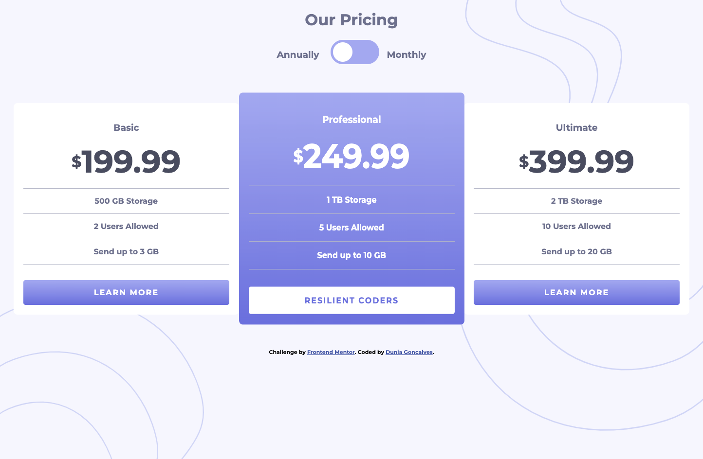
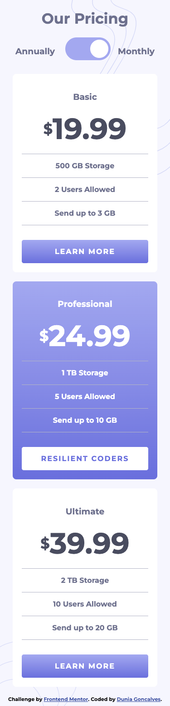

# Frontend Mentor - Pricing component with toggle solution

This is a solution to the [Pricing component with toggle challenge on Frontend Mentor](https://www.frontendmentor.io/challenges/pricing-component-with-toggle-8vPwRMIC). Frontend Mentor challenges help you improve your coding skills by building realistic projects.

## Table of contents

- [Overview](#overview)
  - [The challenge](#the-challenge)
  - [Screenshot](#screenshot)
  - [Links](#links)
- [My process](#my-process)
  - [Built with](#built-with)
  - [What I learned](#what-i-learned)
  - [Continued development](#continued-development)

## Overview

Currently working on adding projects to my portfolio and this is a simple, clean project to showcase html, css and js

### The challenge

Users should be able to:

- View the optimal layout for the component depending on their device's screen size
- Control the toggle with both their mouse/trackpad and keypress

### Screenshot

### Links

- Live Site URL: [FEM-princing-component-toggle](https://duniagoncalves.github.io/FEM-princing-component-toggle/)

## My process

Identify the requirements: Start by understanding the requirements of the component you are building. This includes defining the purpose, functionality, and performance requirements of the component. You may need to work with other stakeholders to gather these requirements.

Plan the architecture: Once you have a clear understanding of the requirements, plan the architecture of the component. This includes deciding on the design patterns, framework, libraries, and programming language you will use.

Write the code: Begin coding the component, following the architecture and design patterns that you planned. Make sure to write clean, maintainable, and reusable code that adheres to the best practices of your programming language and framework.

### Built with

- Semantic HTML5 markup
- CSS
- Flexbox -ish
- Mobile-first workflow

### What I learned

The struggle of getting both onclick and keypress to work together on a checkbox element. Is the best code probably not but it's working!!!

### Continued development

Test the component: Test the component thoroughly, using automated testing tools and manual testing to ensure that it works as intended. This includes testing for functionality, performance, security, and user experience.

Refactor and optimize: Once you have completed testing, refactor the code to ensure it is efficient, inclusive to all users, and maintainable. Optimize the code for performance and security.

Document the component: Document the component by creating clear and concise documentation, including installation instructions, usage examples, and API references.

Deploy the component: Finally, deploy the component to a production environment, ensuring that it works correctly in the target environment. Make sure to monitor the component's performance and address any issues that arise.

## Author

- Website - Coming Soon -
- Twitter - [@duniaknowsbest](https://www.twitter.com/duniaknowsbest)
